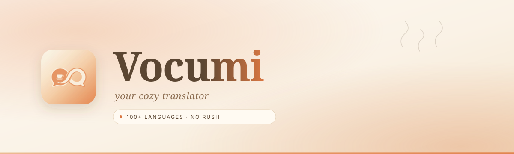

<div align="center">



<br />

[](https://nextjs.org)
[](https://react.dev)
[](https://typescriptlang.org)
[](https://tailwindcss.com)
[](https://vercel.com)

<br />

> *translate, take your time.*

<sub>a soft little place to translate things ♡ 100+ languages, no rush, no popups.</sub>

</div>

<br />

---

## ✦ &nbsp; the vibe

i wanted a translator that felt soft. so i made one ♡

<br />

<table>
  <tr>
    <td width="33%" valign="top">
      <h3>🫖 &nbsp; cream, not white</h3>
      <sub>warm cream, soft amber, cocoa instead of harsh black. easy on the eyes, always.</sub>
    </td>
    <td width="33%" valign="top">
      <h3>🌿 &nbsp; no buttons</h3>
      <sub>just type. it translates as you go. no clicking, no confirming, no rush.</sub>
    </td>
    <td width="33%" valign="top">
      <h3>📜 &nbsp; lil real flags</h3>
      <sub>svg flags so windows users see 🇬🇧 instead of just &ldquo;GB&rdquo;. fraunces serif for the translation itself ♡</sub>
    </td>
  </tr>
</table>

<br />

## ✦ &nbsp; Palette

<table>
  <tr>
    <td></td>
    <td></td>
    <td></td>
    <td></td>
    <td></td>
    <td></td>
    <td></td>
    <td></td>
  </tr>
  <tr>
    <td align="center"><sub><code>cream-50</code></sub></td>
    <td align="center"><sub><code>cream-100</code></sub></td>
    <td align="center"><sub><code>cream-200</code></sub></td>
    <td align="center"><sub><code>amber-glow</code></sub></td>
    <td align="center"><sub><code>amber-warm</code></sub></td>
    <td align="center"><sub><code>cocoa-400</code></sub></td>
    <td align="center"><sub><code>cocoa-600</code></sub></td>
    <td align="center"><sub><code>cocoa-800</code></sub></td>
  </tr>
  <tr>
    <td align="center"><sub><code>#FDF9F3</code></sub></td>
    <td align="center"><sub><code>#FAF2E6</code></sub></td>
    <td align="center"><sub><code>#F4E4CC</code></sub></td>
    <td align="center"><sub><code>#E89968</code></sub></td>
    <td align="center"><sub><code>#D97742</code></sub></td>
    <td align="center"><sub><code>#8A6B4F</code></sub></td>
    <td align="center"><sub><code>#5B4632</code></sub></td>
    <td align="center"><sub><code>#3A2C1E</code></sub></td>
  </tr>
</table>

<br />

## ✦ &nbsp; Typography

<table>
  <tr>
    <td width="50%" valign="top">
      <h3><a href="https://fonts.google.com/specimen/Fraunces">Fraunces</a></h3>
      <sub>the soft serif. used for the brand and the translation text itself ♡</sub>
    </td>
    <td width="50%" valign="top">
      <h3><a href="https://fonts.google.com/specimen/Inter">Inter</a></h3>
      <sub>for everything else. buttons, labels, lil captions, dropdowns.</sub>
    </td>
  </tr>
</table>

<br />

## ✦ &nbsp; Features

<table>
  <tr>
    <td>🌍</td>
    <td><b>100+ languages</b> in a searchable picker with crisp SVG flags</td>
    <td>✨</td>
    <td><b>Auto-detect</b> source language with a live confidence badge</td>
  </tr>
  <tr>
    <td>⌨️</td>
    <td><b>Translate-as-you-type</b> with debounce — no buttons to mash</td>
    <td>🔄</td>
    <td><b>One-tap swap</b> between source and target (text carries over)</td>
  </tr>
  <tr>
    <td>🔊</td>
    <td><b>Text-to-speech</b> for both source and translation</td>
    <td>📋</td>
    <td><b>Copy, save, clear</b> with subtle confirmation states</td>
  </tr>
  <tr>
    <td>📚</td>
    <td><b>History drawer</b> persists to <code>localStorage</code> — restore, remove, clear-all</td>
    <td>🛡️</td>
    <td><b>Resilient</b> — Google primary, MyMemory automatic fallback</td>
  </tr>
  <tr>
    <td>📱</td>
    <td><b>Responsive</b> from 320px to 4K, full keyboard support</td>
    <td>♿</td>
    <td><b>Accessible</b> — ARIA labels, focus rings, semantic HTML</td>
  </tr>
</table>

<br />

## ✦ &nbsp; Stack

| Layer | Tool |
|---|---|
| Framework | **Next.js 15** — App Router, edge-runtime API routes |
| Runtime | **React 19** + **TypeScript** (strict) |
| Styling | **Tailwind CSS 3.4** — custom palette, shadows, keyframes |
| Motion | **Framer Motion 11** — page, panel, micro-interaction animations |
| Icons | **Lucide** outline icons + **flag-icons** SVG country flags |
| Fonts | **Fraunces** + **Inter** via `next/font/google` (zero-CLS) |
| Translation | **Google** public endpoint (primary) → **MyMemory** (fallback) |

<br />

## ✦ &nbsp; Quickstart

```bash
npm install
npm run dev          # → http://localhost:3000
```

```bash
npm run build        # production build
npm run start        # serve production
npm run lint         # eslint
```

<br />

## ✦ &nbsp; Deploy

<table>
  <tr>
    <td valign="top" width="50%">
      <h3>One click</h3>
      <sub>Import the repo on <a href="https://vercel.com/new">vercel.com</a>. Defaults work — no env vars required.</sub>
    </td>
    <td valign="top" width="50%">
      <h3>CLI</h3>

```bash
npm i -g vercel
vercel
```

  </td>
  </tr>
</table>

<br />

## ✦ &nbsp; Project layout

```
src/
├── app/
│   ├── api/translate/route.ts   ← edge-runtime translation (Google + MyMemory)
│   ├── layout.tsx               ← fonts, metadata, viewport
│   ├── page.tsx                 ← hero + translator
│   └── globals.css              ← cozy theme, glass card, scrollbars, grain
├── components/
│   ├── translator.tsx           ← main interactive UI (state, debounce, actions)
│   ├── language-selector.tsx    ← searchable language picker with motion
│   ├── history-panel.tsx        ← slide-out history drawer
│   ├── flag.tsx                 ← SVG flag with auto-detect & globe fallbacks
│   └── logo.tsx                 ← Vocumi brand mark
└── lib/
    ├── languages.ts             ← 100+ languages with ISO country codes
    ├── storage.ts               ← localStorage history helpers
    └── utils.ts                 ← cn(), debounce, timestamp formatting
```

<br />

---

<div align="center">

<sub>powered by <a href="https://translate.google.com">google</a> ✿ backed up by <a href="https://mymemory.translated.net">mymemory</a> ✿ no api keys, ever</sub>

<br />

<sub><b>vocumi</b> · a soft place for words · ✦</sub>

</div>
